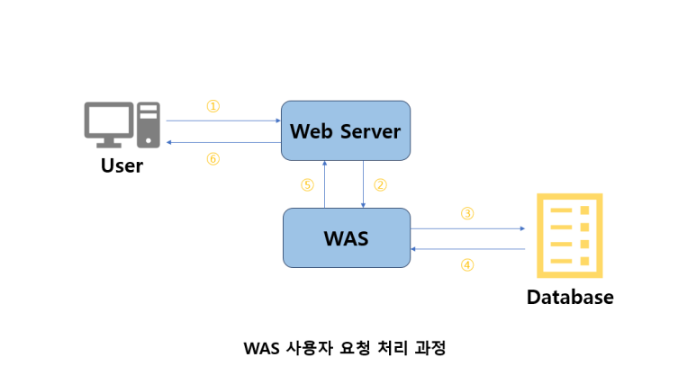
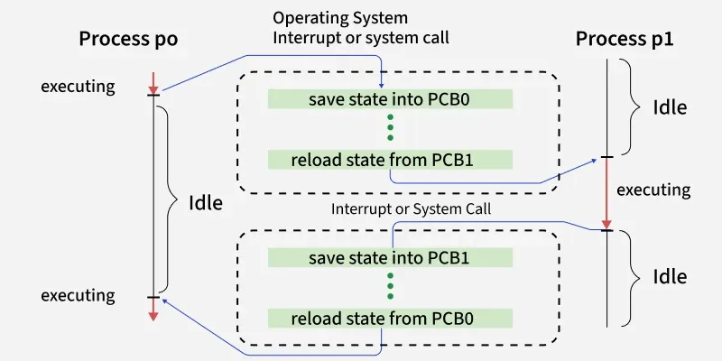
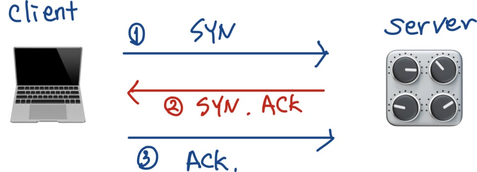

# 3주차 — Connection Pool & 서버 아키텍처

**핵심 질문**

- 서버가 많아지면 DB는 어떻게 버티나?

**내용**

- 요청의 이해
- 서버 스레드 ↔ DB 커넥션 관계
- Pool size 튜닝
- DB가 먼저 죽는 이유

**키워드**

`Request`, `Response`,`Thread`, `Context Switching`, `Concurrency`

## WAS(Web Application Server)



- 인터넷 상에서 **HTTP**를 통해 사용자 컴퓨터나 장치에 애플리케이션을 수행해 주는 **미들웨어**
HTTP: 주로 HTML 문서를 전송하는 용도, 통신 프로토콜
미들웨어: 컴퓨터 제작 회사가 사용자의 특정한 요구대로 만들어 제공하는 프로그램
- 핵심 역할
    - 개발자가 작성한 애플리케이션 실행, 관리
    - 동적 컨텐츠 생성: 누가, 언제 요청하느냐에 따라 다른 결과값을 만들어냄
    - 데이터베이스 연결: 커넥션 풀(Connection Pool), 트랜잭션(Transaction) 관리

### 웹 서버와의 차이


### Web Server와 WAS 상호작용

**위임 (Web Server → WAS)**

- Web Server는 요청을 확인한다.
- 단순한 이미지나 HTML 파일이 아니라, DB 조회나 프로그램 실행이 필요한 '동적 요청'이라고 판단되면 이를 **WAS**에게 넘다.

**결과 반환 (WAS → Web Server)**

- WAS는 DB에서 받은 데이터를 이용해 최종 결과물(동적으로 생성된 HTML, JSON 등)을 만든다.
- 이 완성된 결과를 다시 **Web Server**에게 전달한다.

[https://blog.naver.com/wotjrdl98/224123661358](https://blog.naver.com/wotjrdl98/224123661358)

## 사용자 요청이 서버에 도달했을 때

### Socket Connect

- 사용자의 요청(패킷)이 인터넷 선을 타고 서버 컴퓨터의 Port(포트)에 도착
- 접수원 역할을 하는 **스레드**가 대기하고 있다가 이 **요청**을 낚아챔
    - 스레드는 스레드 풀에서 대기하고 있다가 나온다
        
        → 갑자기 없던게 나타나는게 아니라, 메모리에 미리 만들어져 있다가 호출되는 것
        

요청 (Request) 

- 사용자인 클라이언트(브라우저/앱)가 서버에게 ‘특정한 동작을 수행해달라’고 보내는 메시지
- WAS가 계산기라면 Request는 그 계산기에 입력하는 숫자

1. 물리적 관점: 요청은 이동할 때 '패킷(Packet)'이라는 작은 조각으로 쪼개져 소켓을 통해 들어옴.
    
    → 하나의 연속된 데이터 흐름으로 만들기 위해 재조립 필요
    
2. 논리적 관점 (HTTP Message): 재조립된 데이터는 사람이 읽을 수 있는 HTTP 메시지가 됨.
3. WAS의 역할 (객체 매핑;Object Mapping): WAS는 이 거대한 텍스트 데이터를 분석(Parsing)하여, 자바가 이해할 수 있는 객체(HttpServletRequest)로 변환함.
    
    → 개발자가 직접 String으로 자르거나 분석할 필요 없게 해줌
    
    메서드 호출 하나만으로 원하는 데이터를 꺼내 쓸 수 있게됨
    
4. 생명주기:  만들어진 객체(HttpServletRequest)는 영구적이지 않으며, 스레드가 할당될 때 생성되어 응답을 보내면 즉시 소멸하는, **스레드와 수명을 같이하는 일회용 객체**다.

Thread(스레드):  하나의 프로그램(프로세스) 안에서 동시에 여러 작업을 처리하기 위해 나누어진 **실행 단위,**프로세스 안에서 실제로 일하는 일꾼


- 프로세스(메모리에 적재된 실행 중인 프로그램) 내 각각 Stack에만 독립적인 공간을 주고 text, data, heap 영역은 공유가 된다.
- Stack은 실행흐름, ‘지금 어디까지 실행했는지’가 전부 들어 있음
- 스레드는 자기들이 속한 프로세스 안에서만 메모리와 자원을 서로 공유하면서 동시에 실행된다
    
    → 다른 프로세스랑은 메모리 안 섞임
    

스레드는 자원(Heap)은 공유해서 가볍지만, 스택이 분리되어 있어서 실행 흐름은 독립적이다

### **Thread Pool**에서 스레드 할당

- **Thread Pool**
    - 미리 여러 스레드를 만들어 둠
    - 작업이 오면 기존 스레드에 할당 = 재사용
    - 스레드 생성/삭제 비용 ↓
    
- **코어(Core)**
    - CPU 안에서 실제로 명령을 실행하는 하드웨어 단위
    - 한 코어는 한 순간에 하나의 스레드를 실행

<aside>
💡

여러 코어가 있으면, 각 코어가 서로 다른 스레드를 동시에 실행한다

</aside>

- 멀티 코어( 하나의 CPU 안에 코어가 여러개 있는 것)의 병렬성:
여러 코어가 여러 작업을 나누어 복수로 처리함
예를 들어서 코어가 4개면 4개의 스레드가 ‘동시에’ 작동

- 싱글 코어의 동시성:

코어가 1개이면
👉 물리적으로 동시에 실행 가능한 스레드는 1개뿐

하지만 1개의 코어에 스레드가 10개라면?

- 한 순간에 **실제로 실행되는 스레드는 단 하나**
- 대신 운영체제(OS)가 스레드들을 아주 짧은 시간 단위(Time Slice)로 **빠르게 번갈아 가며 실행**
👉이 방식이 바로 **시분할(Time Slicing)**
    
    

코어 1개가 엄청난 속도로 10개를 번갈아 가며 처리하는데 인간의 눈으로는 이 속도를 구분할 수 없어서

👉**여러 스레드가 동시에 실행되는 것처럼 느껴짐**

이때 **Context Switching** 발생

Context Switching(문맥 교환): CPU에서 여러 프로세스를 돌아가면서 작업을 처리하는 과정

- CPU가 현재 실행 중인 스레드(p0)를 잠시 멈추고, 다른 스레드(p1)로 작업을 전환함
    
    👉스레드를 바꿀 때마다 발생
    
    - 현재 실행 중인 스레드의 **상태 저장(Save)**
    - 다음 스레드의 **상태 복원(Reload)**

### Context Switching 과정

1. p0의 현재 상태(레지스터, 실행 위치 등)를 **PCB에 저장**
2. p1의 저장된 상태를 **PCB에서 불러옴**
3. p1 실행 시작



**Idle Time** (교대 시간)

의미:

- p0이 하던 일을 멈추고(Save)
- p1이 들어와서 자리를 잡는(Reload)
- **실제 연산은 하지 않는 시간**

➡️ 스레드가 많을수록 Idle Time이 자주 발생

**PCB(Process Control Block)**

저장 슬롯(Save File), 하던 일을 그냥 멈추면 안 되고 나중에 다시 와서 이어서 해야 하니 저장 필요

PCB0 저장 + PCB1 로딩 = 비용(Cost) = 점선 박스

➡️Context Switching은 멀티태스킹을 가능하게 하지만, 잦아지면 오히려 성능을 떨어뜨리는 비용이 된다.

### + Context Switching이 대표적으로 잦아지는 경우

- CPU 코어 수보다 스레드 수가 훨씬 많을 때
    
    → **교대 횟수 증가**
    
- Time Slice(할당 시간)가 너무 작을 때
    
    → CPU는 일보다 **교대만 하다가 끝남**
    
- **I/O 작업이 많아 스레드가 자주 대기(Block)될 때**
    
    → OS가 기다리는 동안 다른 스레드를 실행하려고
    
    **Context Switching 발생**
    

### I/O 작업으로 인한 Context Switching 실행 과정

1. 스레드 p0 실행 중
2. p0이 **파일 읽기 / DB 요청 (I/O 요청)**
3. p0은 **대기 상태(Block)** 로 전환
4. OS가 **p1으로 Context Switching**
5. p1 실행

➡️ **p0 ↔ p1 전환 = Context Switching**

---

---

## 스레드가 DB 데이터가 필요할 때

1️⃣ 사용자가 서버에 요청 전송

(로그인, 게시글 조회 등)

2️⃣ 서버는 요청 1개당 **스레드 1개 할당**

3️⃣ 스레드가 필요한 데이터가 있으면

➡️ **DB에 쿼리 요청** 전송

➡️ **DB 응답 대기 = I/O 작업**

➡️ 대기 중 다른 스레드 실행 → **Context Switching 발생**

### 스레드가 DB에 접속하는 과정

      1. DB 서버 찾기: IP와 Port를 통해 DB 서버 위치 확인

2. 3-way HandShake: 통신을 시작하기 전에, 두 컴퓨터(WAS와 DB)가 **"서로 데이터를 주고받을 준비가 되었는지"** 확인하고 연결을 수립하는 **3단계 절차**



- **STEP 1 (SYN): "문 열어주세요."**
    - **WAS → DB:** 접속 요청 메시지(SYN 패킷)를 보냅니다.
    - WAS는 응답이 올 때까지 기다리는 상태(SYN_SENT)가 됩니다.
- **STEP 2 (SYN + ACK): "알겠어. 너도 내 말 들리니?"**
    - **DB → WAS:** 요청을 수락했다는 확인(ACK)과 함께, 나도 너랑 연결하겠다는 요청(SYN)을 묶어서 보냅니다.
    - DB는 마지막 확인을 기다리는 상태(SYN_RECEIVED)가 됩니다.
- **STEP 3 (ACK): "네, 잘 들립니다. 이제 시작합시다."**
    - **WAS → DB:** DB의 요청을 잘 받았다는 확인 메시지(ACK)를 보냅니다.
    - **결과:** 이 3단계가 끝나야 비로소 ESTABLISHED **(연결 확립)** 상태가 되며, 이때부터 실제 데이터(SQL 쿼리 등)를 주고받을 수 있습니다.
    
    3. 인증: ID/PW 및 권한 확인
    
    4. DB 세션 생성: DB가 연결을 위해 자신의 메모리(RAM)를 할당하고 전담 프로세스/스레드를 생성함
    

### 문제점

매 쿼리마다 '네트워크 왕복(RTT)'과 **'**DB 메모리 할당/해제**'** 비용이 발생함. 실제 쿼리 실행 시간보다 연결 만드는 시간이 더 걸리는 **배보다 배꼽이 더 큰 상황** 발생

### 해결방법

커넥션 풀(Connection Pool)

- DB와 미리 연결(Connection)을 맺어둔 객체들을 관리하는 공간(Pool)
- 커넥션은 생성 비용이 비싸서 "매번 새로 연결하지 말고, 미리 만들어둔 걸 빌려 쓰자"는 개념


왼쪽의 Client 5개는 DB에 직접 붙지 않고 커넥션 풀을 바라봄

가운데의 커넥션 풀은 미리 3개의 연결을 만들어 대기중

오른쪽의 데이터베이스는 이미 커넥션 풀과 연결된 상태라 클라이언트 요청시 즉시 처리 가능

### 서버 스레드 ↔ DB 커넥션 관계 (동작 메커니즘)

- **서버 스레드**: 사용자 요청을 실제로 처리하는 실행 단위
- **DB 커넥션**: 서버 ↔ 데이터베이스 사이의 **전용 통신 통로**

---

1️⃣ 1:1 매핑 구조

- 스레드가 DB 작업을 하려면 **커넥션 풀에서 커넥션 1개를 반드시 점유(Active)해야 함**

**이유**

- DB 쿼리는 **연속적인 대화**이기 때문
- 중간에 다른 스레드가 끼어들면 데이터가 꼬일 수 있음
- 따라서 **한 스레드 ↔ 한 커넥션** 구조 사용

**📌 예시**

- 스레드 A → 커넥션 A (전용)
- 스레드 B → 커넥션 B (전용)

➡️ **하나의 커넥션을 여러 스레드가 동시에 공유할 수 없음**

---

2️⃣ Blocking(대기)

- 커넥션 풀에 **남은 커넥션이 없으면** 스레드는 커넥션이 **반납될 때까지 대기(Block) 상태로 전환됨**

---

3️⃣ Context Switching

- 대기 중인 스레드는 **CPU를 사용하지 않음**
- OS가 **다른 스레드를 실행함**
- 이 과정에서 **Context Switching 발생**

핵심 원리: 재사용 (Reuse)

- 생성(Creation): 서버가 켜질 때 미리 정해진 개수만큼 연결을 맺어둠
- 대여(Borrow): 요청이 오면 Pool에서 놀고 있는 Connection을 빌려줌
- 반납(Return): 다 쓰면 연결을 끊는 게 아니라, 다시 Pool에 돌려놓음 (재활용)

효과

- 3-way Handshake 같은 비싼 연결 비용을 0으로 만듦
- 사용자 응답 속도가 획기적으로 빨라짐

---

---

## DB Connection을 많이 늘리면 무조건 성능이 좋아지나?

→ 많을수록 좋은게 아니다.

일반적인 오해: "동시 접속자가 많으니 커넥션 풀도 크게(100개, 200개) 늘려야 한다"

- 기술적 사실: 커넥션 풀의 크기를 무작정 늘리면 성능은 오히려 저하됨
- 이유: DB 커넥션 수만큼 애플리케이션의 스레드도 동시에 동작하게 되는데, 이는 물리적인 CPU 코어 개수의 한계를 초과하기 때문

### Context Switching Overhead

- Context Switching 과정에서 발생하는 추가 비용
    - 레지스터 저장/복원
    - 메모리 상태 저장
    - 캐시 무효화
- 이 시간 동안 실제 작업은 수행되지 않음

Context Switching이 발생하는 과정 중에서 프로세스는 대기시간과 처리시간을 갖게 되는데, 처리시간보다 대기 시간 혹은 교체되는 시간이 더 길어지는 경우가 발생

물리적 코어 수보다 훨씬 많은 커넥션을 유지하면, 스레드 교체 비용 때문에 전체 처리량(Throughput)이 급감함

### HikariCP 권장 Pool Size 산정 공식

기본 공식 (HikariCP 권장)

```
PoolSize= (전체 CPU 코어 수 ×2) + 유효 디스크 수 (Effective Spindle Count)
```

- 전체 CPU 코어 수 x2: DB 작업은 CPU 연산 + 대기(I/O) 가 섞여 있어서 코어 수의 2배정도까지는 커넥션 늘려도 효율적
- Effective Spindle Count: 실제 동시에 I/O 처리가 가능한 디스크 수
    
    (회전하는 디스크의 수, SSD는 보통 1로 계산)
    

실무에서 주로 사용하는 값

- 일반적으로 **CPU 코어 수의 약 2배 내외**
- 예시
    - 4 Core 서버 → 10 ~ 20
    - 8 Core 서버 → 16 ~ 30

---

### 코어 수보다 크게 설정하는 이유 (I/O Bound 특성)

DB 쿼리는 대부분 **I/O Bound 작업**이다.

- CPU 연산 외에도 다음 작업이 포함됨
    - 디스크에서 데이터 읽기/쓰기
    - 네트워크 통신 대기
- 이 과정에서 스레드는 CPU를 사용하지 못하고 대기 상태(Blocking)에 들어감

따라서

- 스레드 A가 I/O 대기 중일 때
- 스레드 B가 CPU를 계속 활용할 수 있도록
- CPU 코어 수보다 약간 많은 커넥션을 유지하는 것이 효율적

DB 작업은 '계산'보다 '대기'가 많으므로, CPU가 노는 것을 보지 않으려면 일을 더 시켜야(커넥션을 더 늘려야) 합니다.


---

### Pool Size를 과도하게 키우면 생기는 문제

- DB 서버에 과도한 부하 발생
- 컨텍스트 스위칭 증가로 성능 저하
- 커넥션 경쟁으로 인해 오히려 응답 시간 증가
- DB 최대 커넥션 수 초과 가능

즉, **무조건 크게 설정하는 것은 위험**함

---

---

## 서버가 많아지면 DB는 어떻게 버티나?

### 1️⃣ 확장성의 비대칭 (Stateless vs Stateful)

WAS (웹 / 애플리케이션 서버)

- **Stateless (상태 없음)**
- 요청을 처리하고 결과만 반환
- 서버 간 상태 공유 필요 ❌
- 트래픽 증가 시 **서버를 쉽게 늘릴 수 있음 (Scale-out)**

예:

WAS 1대 → 10대 → 100대 (문제 없음)

---

DB (데이터베이스)

- **Stateful (상태 있음)**
- 모든 데이터의 **원본** 보관
- 데이터 무결성 유지 필수
- 함부로 복제·분할하면 **데이터 꼬임 위험**

➡️ **확장 난이도 매우 높음**

---

### 2️⃣ 서버 증설의 역설 (Connection Explosion)

상황

- 트래픽 증가 → WAS 증설
- WAS 1대당 DB 커넥션 풀: **10개**

커넥션 증가

- WAS 100대 → **1,000 커넥션**
- WAS 1,000대 → **10,000 커넥션**

➡️ **WAS는 늘릴수록 좋지만,
DB는 커넥션 폭탄을 맞음**

---

### 3️⃣ DB가 먼저 죽는 이유

WAS는 멀쩡한데 DB가 터지는 이유

- **메모리 고갈**
    - 커넥션이 폭증하면 ****메모리가 부족해져 DB가 죽음
- **락 경합 (Contention)**
    - 여러 요청이 동시에 데이터 수정 시도
    - 줄 서기(Waiting)가 발생하고 심하면 서로 꼬
- **Disk I/O(하드디스크(혹은 SSD)에 있는 데이터를 읽거나(Input), 저장하는(Output) 모든 행위)한계**
    - 물리 디스크 쓰기 속도는 한계 존재
- **CPU 스케줄링 지연**
    - 스레드가 너무 많아지면 CPU가 **Context Switching(교대 작업)** 하느라 실제 쿼리 처리를 못 함.

➡️ 결과: WAS는 많은데 DB가 마비됨

DB가 먼저 죽는 이유 중 Disk I/O의 한계와 CPU의 연산 급증이 있다.

---

### 4️⃣ DB 생존 전략 1: 인덱스(Index)

- 테이블에 대한 동작의 속도를 높여주는 자료구조
- 일종의 목차를 생성하고 이를 이용해 속도를 높일 수 있음

- DB가 먼저 죽는 이유 해결 가능
    - Disk I/O 감소
        - 인덱스가 없으면 데이터를 찾기 위해 **테이블 전체를 뒤져야 함 (Full Scan)** ➡️ **Disk I/O 폭발**
        - 인덱스를 타면 **목차만 보고 데이터 위치로 직행** ➡️ **I/O 최소화**
    - CPU 연산 감소
        - 불필요한 데이터까지 메모리에 올려 비교 연산할 필요가 없어짐 ➡️ **CPU 스케줄링 여유 확보**
    
    ### B-Tree(Balanced Tree)
    
- **왜 빠를까?:** 데이터가 무작위가 아니라 **Root(뿌리) → Internal(중간) → Leaf(끝)** 순서로 정렬되어 있음.
- **특징:**
    - **Balanced:** 모든 리프 노드들이 같은 레벨(깊이)을 갖도록 자동으로 밸런스를 맞춤 (검색 속도가 일정함)
    - **Efficient:** 이진 트리와 달리 하나의 노드에 많은 정보를 담아 트리의 높이를 낮춤 (Disk I/O 횟수 감소)
    - **동시성(Concurrency) 향상:** 데이터를 빨리 찾고 커넥션을 빨리 반납하므로, 더 많은 사용자가 동시에 접속해도 버틸 수 있습니다.
        
        
        


- **왜 DB 인덱스로 B-Tree를 선택했는가?**
    - 배경: 보조기억장치의 특성과 한계
        
        **① 속도 차이**
        
        - 실행 중인 코드와 데이터가 위치한 **메인 메모리(RAM)** 는 매우 빠름
        - 반면 DB 데이터가 저장된 **보조기억장치(HDD / SSD)** 는 상대적으로 매우 느림
        
        **② I/O 단위 – Page**
        
        - 보조기억장치는 데이터를 **1바이트 단위**로 읽지 않음
        - 항상 **페이지(Page)** 라는 **고정 크기 블록 단위**로 데이터를 한 번에 읽어옴
        
        **③ 문제점**
        
        - 필요한 데이터가 1개뿐이어도
            
            → 그 데이터가 포함된 **페이지 전체를 메모리에 로드**
            
        - 결과적으로 **불필요한 데이터까지 읽는 낭비** 발생
    - 목표: 디스크 접근(I/O) 횟수 최소화
        - DB 성능의 핵심 병목은 **느린 보조기억장치 접근**
        - 따라서 성능 최적화의 본질은:
            - **디스크 접근 횟수를 최대한 줄이는 것**
        
        📌 핵심 전략:
        
        - **한 번 접근할 때(페이지 1회 I/O)**
            
            → 최대한 **의미 있고 연관된 데이터**를 많이 가져와야 함
            
    - 해결책: B-Tree의 구조적 이점
    
     1. 높은 페이지 활용도 (Locality)
    
    - B-Tree의 각 노드는 **서로 연관된 Key-Value 집합**을 하나의 노드로 묶어 저장
    - 이 노드는 보통 **디스크의 페이지 하나와 거의 1:1로 매핑**됨
    
    👉 결과:
    
    - **한 번의 디스크 I/O로**
        - 단일 값이 아니라
        - **여러 개의 탐색에 필요한 핵심 정보**를 동시에 확보
    
     2. 적은 디스크 접근 횟수
    
    - 하나의 노드에 **많은 Key를 저장**할 수 있음
    - 그 결과:
        - 트리의 **높이가 낮아짐**
        - 탐색 시 거쳐야 할 노드(페이지) 수가 줄어듦
    
    - **Root → Internal → Leaf**
    - 소수의 페이지 접근만으로 원하는 데이터 위치 도달

위에서 아래로 내려갈수록 **속도는 느려지고, 용량은 커지는** 관계

- **CPU (보라색):**
    - **역할:** 실제로 계산을 하고 데이터를 처리하는 두뇌.
    - **특징:** 엄청나게 빠릅니다 (나노초 단위). 하지만 저장 공간이 거의 없습니다.
- **Main memory (RAM) (초록색):**
    - **역할:** 실행 중인 프로그램과 데이터가 잠시 머무르는 작업대.
    - **특징:** CPU보다는 느리지만 꽤 빠릅니다. 전원이 꺼지면 데이터가 날아갑니다 (휘발성).
- **Secondary storage (SSD or HDD) (파란색):**
    - **역할:** DB 데이터가 영구적으로 저장되는 창고.
    - **특징:** 용량이 크고 영구적이지만, **RAM보다 수만 배 이상 느립니다.**


- DB의 실제 데이터는 맨 아래 **파란색 박스(보조기억장치)** 에 저장
- **CPU**가 연산을 수행하려면 데이터를 반드시 **RAM**으로 먼저 가져와야 한다.
- 이때 발생하는 **보조기억장치 ↔ 메인 메모리 간 이동(I/O)** 은 시스템에서 **가장 느린 구간**

👉 따라서 성능의 핵심 병목은 **이 파란색 → 초록색으로의 데이터 이동 횟수**에 있다.

- 인덱스(B-Tree)는 필요한 데이터의 위치를 빠르게 찾아줌으로써 **불필요한 디스크 접근을 줄이고 최소한의 I/O로 필요한 데이터만 RAM에 적재**하도록 도움

➡️ 결과적으로 CPU는 기다리는 시간을 줄이고, DB 전체 처리 성능과 동시 처리 능력이 향상된다.

 [https://bugoverdose.github.io/computer-science/why-use-btree-for-db-index/](https://bugoverdose.github.io/computer-science/why-use-btree-for-db-index/)

---

### 5️⃣ DB 생존 전략 2: 분산 아키텍처

읽기 / 쓰기 분리 (Replication)

- **Master DB**
    - 쓰기 전용 (Insert / Update / Delete)
- **Slave DB**
    - 읽기 전용 (Select)
    - 여러 대 운영 가능

📌 효과:

- 전체 트래픽의 대부분인 **조회 요청 분산**

⚠️ 주의:

- **복제 지연(Replication Lag)** 존재

→ Master에 쓴 데이터가 Slave로 복사되는 찰나의 시간차(Replication Lag)

---

캐싱 (Caching)

- Redis / Memcached (임시저장소) 사용
- 자주 조회되는 데이터는 **메모리에서 바로 반환**

📌 효과:

- DB 접근 자체를 줄임
- **부하 감소 효과 가장 큼**

---

샤딩 (Sharding)

- 데이터 자체를 **수평 분할**
- 예:
    - A~M → DB1
    - N~Z → DB2

📌 효과:

- 단일 DB의 데이터·부하 분산

⚠️ 단점:

- 쪼개진 데이터를 다시 합쳐서 검색(Join)하기가 어려움
- 관리 어려움