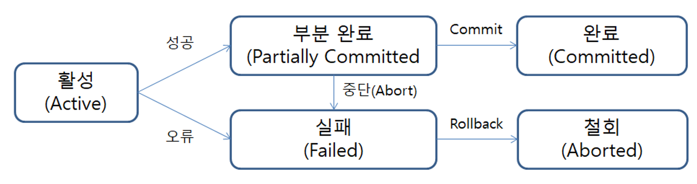
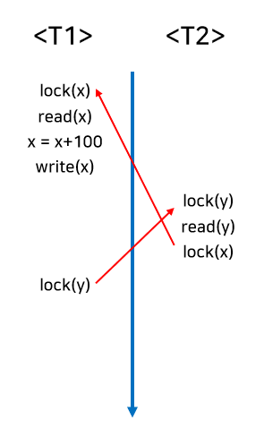

# 4주차 — 트랜잭션 & 동시성 (서버 관점)

**핵심 질문**

- 여러 서버가 동시에 접근하면 무슨 일이 생기나?

**내용**

- Transaction 이란 ?
- Isolation 과 Isolation Level
- 서버 레벨 동시성 vs DB 레벨 동시성
- 왜 Serializable을 안 쓰는가

**키워드**

`ACID`, `Isolation`, `Lock`

## Transaction(트랜잭션)

- 정의
    
    DB의 상태를 변경시키는 하나의 논리적인 작업 단위
    → 이 작업들은 전부 성공하거나, 전부 실패해야 함
    
    - 사용자 관점: 하나의 논리적 작업 단위
    - 시스템 관점: DB를 접근·변경하는 프로그램 단위
    
- 목적
    - 데이터 완전성 유지
        - 트랜잭션이 모두 성공하면 변경 내용이 반영되고(commit), 하나라도 실패하면 모든 변경 사항을 취소(rollback)해서 이전의 정상 상태로 되돌림
    - 부분 실행 방지
        - 모든 쿼리가 성공해야만 결과가 실제로 DB에 적용됨
        - 일부 쿼리만 실행된 상태가 DB에 남지 않도록 함
- 특징
    
    ### A. Atomicity (원자성)
    
    - 트랜잭션은 **쪼갤 수 없는 하나의 단위**
    - 전부 성공하거나 전부 실패
    
    ### C. Consistency (일관성)
    
    - 트랜잭션 전후로 DB는 항상 이상한게 하나도 없는 **상태**를 유지
    - DB에 설정된 미리 정해진 규칙을 하나도 어기지 않음
    
    ### I. Isolation (격리성)
    
    - 동시에 실행되는 트랜잭션들이 **서로 간섭하지 않음**
    - 중간 결과를 다른 트랜잭션이 볼 수 없음
    - 동시에 실행 되더라도 각 트랜잭션은 혼자 실행되는 것처럼 보이게 함
        
        ### Isolcation Level (격리 수준)
        
        [https://mangkyu.tistory.com/299](https://mangkyu.tistory.com/299)
        
        Isolation을 **어디까지 보장할 것인지**를 단계로 나눈 것
        
        위부터 차례대로 1~4단계
        
        | 격리 수준 | 설명 | 발생 가능 문제 |
        | --- | --- | --- |
        | READ UNCOMMITTED | 커밋되지 않은 데이터도 읽음 | Dirty Read: 데이터의 정확성을 보장하지 않음 |
        | READ COMMITTED | 커밋된 데이터만 읽음 | Non-repeatable Read: 같은 트랜잭션 안에서 같은 데이터를 두 번 읽었는데 값이 달라지는 현상 |
        | REPEATABLE READ | 변경 전의 레코드를 백업해서 변경 전/후 데이터가 모두 존재함 새로운 레코드의 추가를 막지 않음 | Phantom Read: 트랜잭션이 끝나기 전에 다른 트랜잭션에 의해 추가된 레코드가 발견될 수 있 |
        | SERIALIZABLE | 대상에 각각 읽기/쓰기 잠금을 거는 것, 완전한 순차 실행 | 모든 트랜잭션을 순차 실행한 것처럼 보이게 하기 위해
        읽기에도 Lock을 걸어 동시 실행을 사실상 차단한다 |
        
        격리 수준이 높을수록
        
        - 정합성 ↑
        - 성능 ↓
    
    ### D. Durability (지속성)
    
    - commit이 완료되면 결과는 **영구적으로 저장**
    - 시스템 장애가 발생해도 데이터는 유지됨

- 연산, 상태
    
    
    
    ### COMMIT
    
    - 트랜잭션 성공 선언
    - 변경 내용을 DB에 최종 반영
    
    ### ROLLBACK
    
    - 트랜잭션 실패 선언
    - 수행 이전 상태로 복구
    
    ### Active
    
    - 트랜잭션이 실행 중이며 동작 중인 상태
    
    ### Partially Committed
    
    - 트랜잭션의 COMMIT 명령이 도착한 상태
    - COMMIT 요청 직전
    
    ### Aborted
    
    - 트랜잭션 취소 상태
    - 트랜잭션 실행 이전 데이터로 돌아간 상태
    
    → ROLLBACK 연산 실행한 상태
    
    ❓ **Partially Committed** vs **Committed**
    
    - **Partially Committed**: COMMIT 요청만 들어온 상태
    - **Committed**: COMMIT이 실제로 완료된 상태

- 주의점
    - 트랜잭션 범위는 **최소화**
    - 트랜잭션이 길어질수록
        - 커넥션 점유 ↑
        - 성능 저하 ↑
        - 대기 트랜잭션 증가

예를 들어 [맛집 테이블 = DB 커넥션] 이라고 하면

- **DB 커넥션:** 식당의 테이블 (개수가 제한적임, 예: 10개)
- **트랜잭션:** 손님이 자리에 앉아서 주문하고 밥을 먹고 나가는 과정
- **사용자:** 식당 밖에서 줄 서 있는 손님들

**상황 A: 트랜잭션이 긴 경우 (나쁜 예)**
손님이 테이블을 잡고(커넥션 점유), 밥을 다 먹었는데도 **안 나가고 친구랑 20분 동안 통화**를 한다(불필요한 작업 수행)

- **결과:** 밖에서 기다리는 손님(대기 트랜잭션)이 늘어나고, 식당 회전율(성능)이 떨어진다

**상황 B: 트랜잭션 범위를 최소화한 경우 (좋은 예)**
손님이 밥만 딱 먹고 바로 일어난다. 통화는 가게 밖에서 한다

- **결과:** 테이블이 빨리 비어서 다음 손님이 바로 들어온다. 회전율이 빠르다

### 병행제어 (Concurrency Control)

- 목적
    - 여러 트랜잭션이 동시에 실행되어도 DB 일관성 유지
    - 매우 빠르게 여러 트랜잭션 사이를 이동하면서 조금씩 처리를 수행하는 방식
    - DB 공유 최대화, 질서 있게 동시에 처리하게 함
- 기법

### 로킹(Locking)

- 데이터 접근 시 잠금 획득
- S-lock (읽기) - 여러 트랜잭션이 **동시에 가능**
- X-lock (읽기+쓰기) - 나 혼자만 가능
- **2단계 로킹**(2PL)으로 직렬가능성 보장
1. 확장 단계: 잠금이 획득되고 잠금이 해제되지 않는다.
2. 축소 단계: 잠금이 해제되고 잠금이 획득되지 않는다.
    
    **단점**
    
- **Deadlock** 발생 가능
교착상태(Deadlock): 서로가 가진 Lock을 기다리며 **영원히 멈춰 있는 상태**
서로가 가진 Lock을 기다리며 **무한 대기**
    
    
    

### **타임 스탬프(Time Stamp)**

- 트랜잭션에 시간 부여
- Deadlock ❌ - 기다림 자체가 없음
- 나중에 온 트랜잭션 때문에 이전 트랜잭션이 되돌려질 수 있음 → 연쇄 복귀 가능

### **낙관적 병행제어(Optimistic Concurrency Control)**

- 수행 중 검사 ❌
- 종료 시 충돌 검사
    - 충돌 있으면 ❌ → rollback
    - 없으면 ✅ → commit

### **다중 버전 병행제어(Multi-version Concurrency Control)**

한 데이터에 대해 여러 버전의 값을 유지하며 관리하는 방식

- 데이터 수정 시
    - 기존 값 유지
    - 새 버전 생성
- 읽는 트랜잭션은
    - **자기 시점에 맞는 버전**을 읽음
- 읽기 트랜잭션은 Lock 없이 동작 가능하여 **읽기 성능과 동시성이 크게 향상됨**

[https://velog.io/@shasha/Database-트랜잭션-정리](https://velog.io/@shasha/Database-%ED%8A%B8%EB%9E%9C%EC%9E%AD%EC%85%98-%EC%A0%95%EB%A6%AC)

## 여러 서버가 동시에 접근하면 실제로 일어나는 일

### 서버가 하나라는 것은?

- 하나의 DB에
- 여러 WAS(서버)가
- 동시에 트랜잭션을 날림

서버 수가 증가하면 동시 트랜잭션 수가 폭증한다

### 발생 가능한 대표적 문제들

앞의 Isolation Level에서 설명함

- Dirty Read
- Non-repeatable Read
- Phantom Read
- Lost Update (실무 최악)

**Isolation Level이 낮을수록 더 잘 발생**

### 서버 레벨 동시성과 DB 레벨 동시성의 차이

### 서버 레벨 동시성

- 멀티 스레드
- 비동기 처리
- Thread Pool

→ 요청을 빨리 많이 받는 문제

### DB 레벨 동시성

- Lock
- MVCC
- Isolation Level

→ 데이터가 깨지지 않게 지키는 문제

서버에서 아무리 동시 처리를 잘해도 **DB 동시성 제어가 없으면 데이터는 깨진다**

### 왜 SERIALIZABLE 격리 수준을 사용하지 않는가

1. 성능 문제
- 모든 읽기/쓰기에 Lock
- 동시성 거의 없음
- 사실상 **순차 실행**

---

1. 대기 트랜잭션 폭증
- Lock 대기
- 응답 지연
- 타임아웃 증가

---

1. 실무는 “완벽함”보다 “균형”
- 대부분 DB는
    - READ COMMITTED
    - REPEATABLE READ

```java
@Transactional(isolation = Isolation.READ_COMMITTED)
public void saveMainAccount(Long memberId) {
 // ...
}
```

이런식으로 트랜잭션을 설정해줌

격리 수준은 **READ COMMITTED**로 해주라는 뜻 = Dirty Read(확정되지 않은 데이터=커밋 전 데이터)는 읽지 않도록 보장하겠다는 

- 필요한 곳만 Lock / SELECT FOR UPDATE(필요한 곳에만 잠금)
기본 격리 수준은 낮추고, 동시성 제어가 꼭 필요한 순간에만 수동으로 Lock을 걸

SERIALIZABLE은 가장 안전하지만 성능 비용이 너무 크기 때문에 실무에서는 낮은 격리 수준 + 필요한 곳에만 Lock을 사용한다

[https://mangkyu.tistory.com/299](https://mangkyu.tistory.com/299)

### READ COMMITTED에서 데이터 변경이 일어나는 방식


상황 설명

- 사용자 A가 트랜잭션을 시작
- 어떤 데이터를 변경
- **아직 COMMIT 하지 않은 상태**

이때 DB 내부에서는

- 테이블에는 **변경된 값이 기록됨**
- 동시에
    - 변경 전 데이터는 **UNDO 로그**에 저장됨

즉,

- 현재 값 → 테이블
- 이전 값 → UNDO 로그

### 다른 트랜잭션이 데이터를 조회하는 경우


이때 사용자 B가 데이터를 조회하면,

- READ COMMITTED는 **커밋된 데이터만 조회 가능**
- 아직 사용자 A가 커밋하지 않았으므로
    - 테이블의 최신 값은 사용할 수 없음
    - **UNDO 로그에 저장된 변경 전 데이터가 반환됨**

사용자 A가 **COMMIT을 수행한 이후부터** 다른 트랜잭션에서도 변경된 값을 조회할 수 있다.

### READ COMMITTED의 한계: Non-Repeatable Read

READ COMMITTED에서는

**Non-Repeatable Read(반복 읽기 불가능)** 문제가 발생할 수 있다.

### 예시 상황

1. 사용자 B가 트랜잭션을 시작하고
    
    name = "Minkyu" 조건으로 레코드를 조회
    
    → 결과 없음
    
    
    
2. 이후 사용자 A가 해당 조건을 만족하는 레코드를 UPDATE 또는 INSERT 후 **COMMIT**
3. 사용자 B가 같은 트랜잭션 안에서
    
    다시 동일한 조건으로 조회
    

👉 이번에는 **결과가 조회됨**


즉,

**같은 트랜잭션 안에서 같은 조건으로 조회했는데 결과가 달라지는 현상**이 발생한다.

이를 **Non-Repeatable Read**라고 한다.

### 왜 문제가 될 수 있는가?

Non-Repeatable Read는 일반적인 조회에서는 큰 문제가 되지 않을 수 있다.

하지만 다음과 같은 경우에는 **심각한 오류**로 이어질 수 있다.

### 예시: 금전 처리

- 하나의 트랜잭션에서
    - 오늘 입금된 총액을 여러 번 조회하며 계산
- 동시에 다른 트랜잭션에서
    - 입금 내역을 계속 커밋

READ COMMITTED에서는 조회 시점마다 결과가 달라질 수 있으므로 **계산 결과가 일관되지 않게 됨**