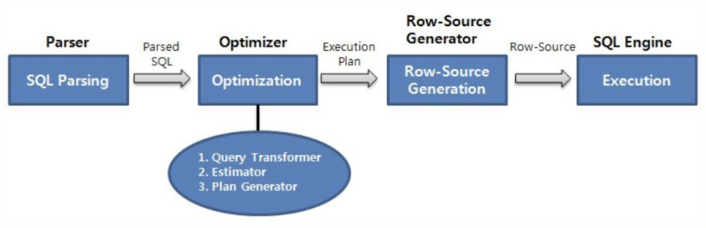
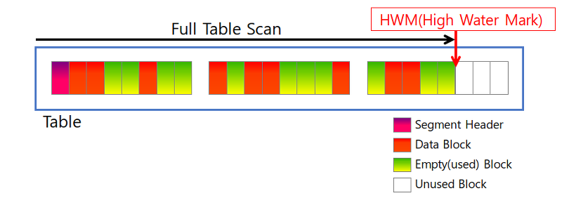
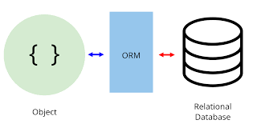

# 5주차 — 쿼리 성능과 서버 병목

**핵심 질문**

- 느린 건 서버야? DB야? ( DB 엔진은 ? )

**내용**

- Query 실행 흐름
- Index가 서버 성능에 미치는 영향
- N+1 문제
- ORM 이란 ?
- ORM이 DB를 망칠까 안망칠까

**키워드**

`Index`, `Execution Plan`, `ORM`

성능 최적화의 출발점은 “**어디가 느린가?**”를 정확히 아는 것
→ 전체 응답 시간 중 **누가 시간을 쓰고 있는가?**

전체 응답 시간

$\text{Total Time} = \text{Network} + \text{Web Server(Logic)} + \text{DB Time}$

→ Web Server가 느린지 DB Time이 느린지 구분해야됨

## 서버(Server) vs 데이터베이스(DB)

| 구분 | 서버(Server, Logic) | 데이터베이스(DB) |
| --- | --- | --- |
| 전체 시간 중 차지 | Web Server Time ↑ | DB Time ↑ |
| 쿼리 실행 시간 | 짧음 | 김 |
| API 로그 | Controller/Service 오래 걸림 | DB 호출에서 대기 |
| 체감 증상 | 로직 복잡할수록 느림 | 데이터 많을수록 느림 |
| 대표 원인 | 반복 처리, N+1 | 인덱스 없음, Full Scan |
| 진단 질문 | “쿼리 빼면 빨라질까?” | “이 쿼리 자체가 느린가?” |
- Server Time이 큰 경우

[ API 요청 ]
├─ DB 호출 (10ms)
├─ 반복 처리
├─ 객체 변환
└─ 추가 쿼리 (N+1)

- 쿼리는 빠른데 호출이 많음
- 로직 구조 문제, 쿼리 하나하나는 빠른데 서버가 쿼리를 많이 호출하느라 시간을

→ 서버 병목(전체 시간을 대부분 잡아먹음)
 

**원인:**

- 복잡한 연산(for문 중첩 등)으로 인한 CPU 과부하.
- 외부 API 호출 지연.
- 메모리 누수(Memory Leak)로 인한 가비지 컬렉션(GC) 빈발.

- DB Time이 큰 경우

[ API 요청 ]
└── DB 호출 ────────(5s)──────▶

- DB 쿼리 하나가 오래 걸림
- 실행 계획, 인덱스 문제

→ DB 병목 

- **원인 (DB 엔진 내부 상황):**
    - **I/O 병목:** 데이터를 메모리(Buffer Pool)에서 찾지 못해 디스크(Disk)에서 읽어오느라 느림
    - **CPU 병목:** 정렬(ORDER BY), 그룹화(GROUP BY) 등 연산 비용이 높은 쿼리 수행
    - **Lock 대기:** 다른 트랜잭션이 데이터를 잡고 있어서(Lock) 기다리는 시간

DB 엔진은?

**MySQL의 기본 엔진: InnoDB**

- **특징:** 트랜잭션 지원(ACID), **Row-level Lock(행 단위 잠금)** 지원, MVCC(Non-locking Consistent Read) 지원
- **성능 영향:** 과거 MyISAM(Table-level Lock)과 달리, 특정 행만 잠그기 때문에 **동시성(Concurrency)** 처리에 매우 유리함
- **Clustered Index:** InnoDB는 테이블 자체가 PK(Primary Key) 기준의 B-Tree로 정렬되어 저장됨. 즉, **PK로 조회하면 가장 빠름**

## 쿼리 실행 흐름

- SQL :
데이터베이스에서 데이터를 질의, 조작, 정의, 제어하기 위한 **구조적**(Structured)이고 **집합적**이며 **선언적**인 언어

DB는 SQL을 받으면 항상 이 순서로 처리함

SQL
→ Parsing
→ Optimization
→ Execution

### 1. Parsing (파싱)

- SQL 문법 검사
- 테이블 및 컬럼(테이블의 한 칸) 존재 여부 확인
- 권한 검사

문법 또는 객체 오류가 있으면 이 단계에서 실패

### 2. Optimization (최적화)

- SQL을 실행하는 여러 방법 중 **가장 비용이 낮은 실행 전략 선택**
- 인덱스 사용 여부 결정
- 조인(두 테이블을 동시에 읽고 비교함) 순서 결정

→ 이 단계의 결과물이 **실행 계획(Execution Plan)**

### 3. Execution (실행)

- 실행 계획에 따라 실제 데이터 접근
- 디스크 / 메모리에서 데이터 읽기
- 정렬, 조인, 그룹 연산 수행
- 결과 반환

→ **실제 성능 병목은 대부분 이 단계에서 발생**

### 데이터베이스가 쿼리를 처리하는 전략

[https://hoon93.tistory.com/53](https://hoon93.tistory.com/53)

- Full Table Scan
    
    
    
- 정의: 테이블에 있는 **모든 블록**을 처음부터 끝까지 읽으면서 데이터를 찾는 방식
- 범위**:** 데이터가 한 번이라도 저장되었던 최고 수위(HWM, High Water Mark)까지의 모든 블록을 읽음 (현재 데이터가 지워져서 비어있어도 읽음)
- 특징
    - **Multi-Block I/O:** 인덱스 스캔이 블록을 하나씩(Single Block) 읽는 것과 달리, FTS는 한 번의 I/O로 **여러 블록을 뭉텅이로** 가져
    - **효율성:** 특정 행(Row) 하나를 찾는 건 느리지만, **대량의 데이터**를 가져올 때는 인덱스보다 훨씬 효율적
    - **메모리 관리:** FTS로 읽은 데이터는 "재사용성이 낮다"고 판단되어, 메모리에서 **금방 삭제**되도록 관리됨 (다른 중요한 데이터를 밀어내지 않기 위함)
- FTS를 선택하는 상황
    - 인덱스가 없을 때
    - 데이터 범위가 넓을 때: 테이블의 상당 부분(예: 20~30% 이상)을 읽어야 한다면, 인덱스를 거치는 비용보다 그냥 훑는 게 더 빠름
    - 테이블이 너무 작을 때: 데이터가 적어서 한 번의 I/O로 다 읽을 수 있다면, 굳이 인덱스를 탈 필요가 없음
    - 병렬 처리 (Parallel Query): 여러 CPU가 동시에 데이터를 읽을 때는 FTS가 구조적으로 유리함

- Index Scan
    
    
    
- 정의:  인덱스(목차)에 저장된 **키 값**을 이용해 데이터를 찾음
- 방법:
    - 인덱스에서 조건에 맞는 값을 찾는다.
    - 그 옆에 적힌 주소를 보고 테이블의 실제 데이터 위치로 이동한다. (이를 **Random I/O**라고 )
- 특징:
    - 커버링 인덱스 (Covering Index): 테이블 방문 생략
    찾으려는 데이터(컬럼)가 이미 인덱스 안에 다 있다면, 굳이 무거운 테이블(본문)까지 안 가고 인덱스에서 바로 끝내서 성능이 매우 빠름
    - 결합 인덱스 (Composite Index)의 정렬 순서
    A+B라면 A로 정렬되고, A가 같으면 B로 정렬된다
    인덱스는 생성할 때 지정한 컬럼 순서대로 **엄격하게 정렬**되어 저장됨. 따라서 **첫 번째 컬럼(선두 컬럼)** 조건 없이 두 번째 컬럼만으로는 검색 효율이 떨어짐
    - 정렬 효과 (Sorting)
    이미 정렬된 상태로 읽어오기 때문에, 별도의 **ORDER BY 연산을 생략**할 수 있어 CPU 비용을 아낄 수 있습니다.
    
    | **구분** | **Index Scan (인덱스 스캔)** | **Full Table Scan (전체 테이블 스캔)** |
    | --- | --- | --- |
    | **핵심 동작** | 인덱스(목차)를 먼저 읽고, 주소를 통해 데이터를 찾아감 | 테이블의 처음부터 끝까지 모든 블록을 순서대로 읽음 |
    | **I/O 방식** | **Random I/O** (Single Block)
    디스크 헤드가 여기저기 점프하며 블록을 **하나씩** 읽음 | **Sequential I/O** (Multi-Block)
    한 번의 요청으로 인접한 **여러 블록**을 뭉텅이로 읽음 |
    | **유리한 경우** | **소량의 데이터** 검색 (전체의 **10~15% 미만**)
    특정 데이터를 '콕' 집어낼 때 | **대량의 데이터** 검색
    전체 통계, 집계, 혹은 범위가 매우 넓을 때 |
    | **정렬 여부** | **O (정렬됨)**
    인덱스 생성 시 정해진 순서대로 반환됨 | **X (정렬 안 됨)**
    디스크에 저장된 순서대로 무작위로 반환됨 |

### 인덱스(Index)

- 구조
    - 대부분의 DB에서 **B-Tree 구조** 사용
    - **정렬된 상태**로 데이터 저장
    - 실제 데이터를 가리키는 **포인터**를 가짐
- 작동 원리
    - 전체 테이블을 읽지 않고 **필요한 위치로 바로 이동**
- 조회 성능(Read) 향상과 쓰기 성능(Write) 저하 → Trade-off
    - 인덱스가 없는 경우
    Write: 엄청 빠름
    Read: 엄청 느림(Full Table Scan)
    - 인덱스가 있는 경우
    Write: 느려짐(오버헤드 발생)
    → 데이터를 단순히 끝에 추가하는 것이 아니라, 정렬 순서에 맞춰 제자리를 찾아 넣어야 하기 때문임. 인덱스 개수만큼 이 재정렬 작업이 반복
    Read: 엄청 빠름(Index Scan)

## **ORM(Object-Relational Mapping)**

- 객체 지향 언어와 관계형 데이터베이스의 매핑
- 객체 지향 언어(Java, Python)와 관계형 데이터베이스(MySQL, Oracle)는 데이터를 다루는 방식이 근본적으로 다른데, ORM은 이 간극(Mismatch)을 메워주는 다리 역할
- 어플리케이션과 데이터베이스 연결 시 SQL언어가 아닌 어플리케이션 개발언어로 데이터베이스를 접근할 수 있게 해줌

- 장점
    - 생산성과 가독성
        - SQL문(SELECT, INSERT)을 직접 짜는 대신, 직관적인 메서드(find(), save())로 데이터를 조작할 수 있음
        - 개발자는 SQL 문법보다 비즈니스 로직 작성에 더 집중할 수 있음
    - 유지보수와 재사용성
        - 객체 지향적인 코드 작성이 가능해져 디자인 패턴을 적용하기 쉬움
        - 독립적으로 작성된 객체들은 재사용하기 편리
    - DBMS 종속성 하락
        - MySQL을 쓰다가 Oracle로 DB를 바꾸더라도, 자바 코드를 뜯어고칠 필요 없이 ORM 설정만 바꾸면 됨 (ORM이 알아서 해당 DB에 맞는 SQL을 생성)

### **N+1 문제**

1번의 쿼리로 부모 엔티티를 조회한 뒤 각 부모마다 자식 엔티티를 조회하면서 N번의 추가 쿼리가 발생하는 문제 **→** 총 **1 + N 번의 쿼리 실행**

- 발생 원인
    - ORM의 **Lazy Loading(지연 로딩)** 기본 전략
    - 객체 접근 시점에 쿼리가 실행되기 때문
- 해결 방법 (Eager Loading vs Lazy Loading)

Eager Loading

- 처음부터 연관 데이터를 JOIN으로 함께 조회
- 쿼리 수 감소
- 불필요한 데이터까지 조회할 수 있음

Fetch Join (권장)

- 필요한 시점에 명시적으로 JOIN
- 쿼리 수 제어 가능
- 성능과 제어의 균형이 좋음

### **ORM이 DB를 망칠까, 안 망칠까?**

ORM의 장점과 한계

- **장점**: 생산성, 코드 가독성, DBMS 독립성 제공
- **한계**:
    - ORM이 자동 생성하는 SQL이 항상 최적화되지 않음
    - 복잡한 JOIN이나 대량 데이터 처리에서 성능 저하 가능
    - 실행 계획을 직접 제어하기 어려움

- Raw Query가 필요한 시점
    - 복잡한 통계 쿼리
    - 대용량 배치 처리
    - 성능 최적화가 꼭 필요한 핵심 구간

ORM만 고집하면 성능 문제가 생길 수 있음

- ORM을 잘 쓰는 법
    - **ORM이 만든 SQL을 이해하고 점검** (EXPLAIN 사용)
    - 단순 CRUD는 ORM 사용 → 빠르고 편리
    - **복잡한 쿼리나 성능 민감 구간은 Raw Query 병행**